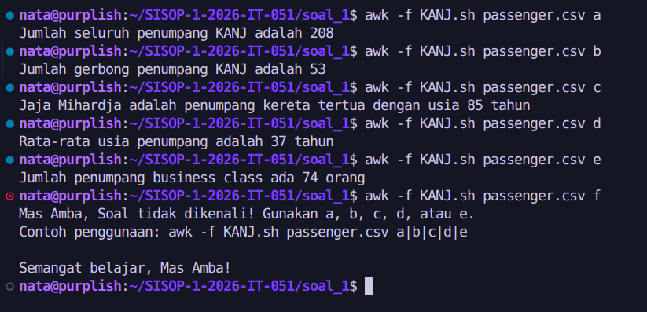
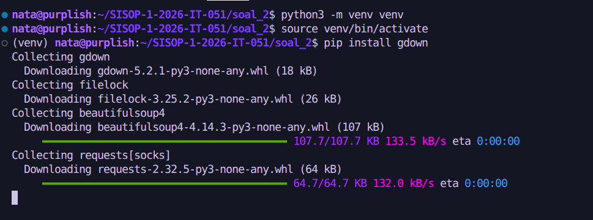
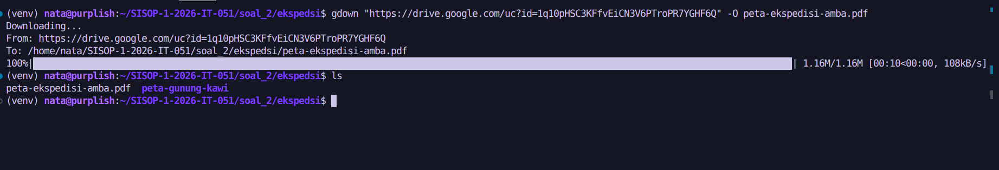
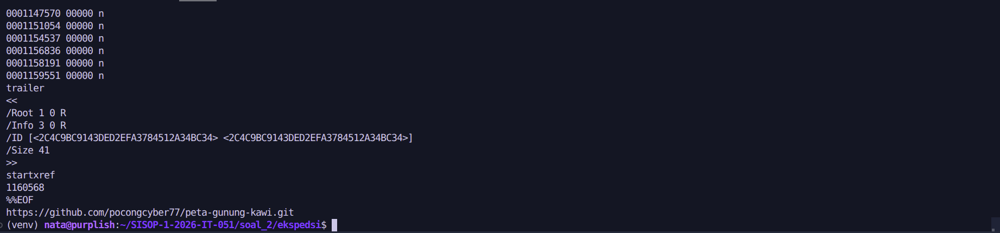
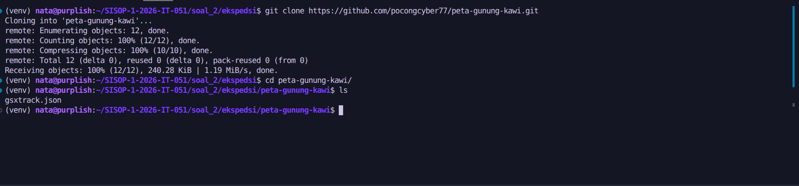
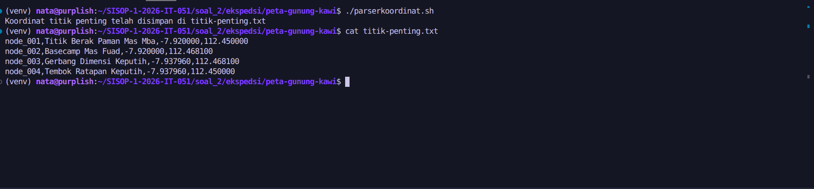
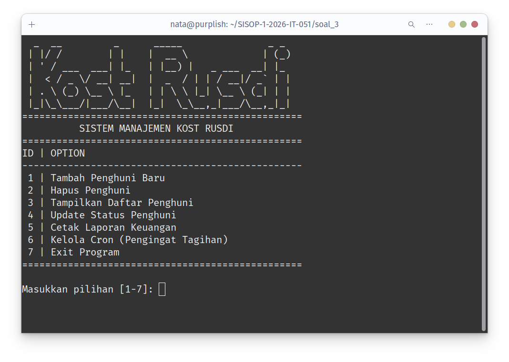

# SISOP Modul 1

<details>
<summary>Daftar Isi</summary>

- [SISOP Modul 1](#sisop-modul-1)
  - [Soal 1: KANJ](#soal-1-kanj)
    - [Screenshot](#screenshot)
    - [Deskripsi Soal](#deskripsi-soal)
    - [Menjalankan Script](#menjalankan-script)
    - [Header Skip](#header-skip)
    - [Penjelasan Soal](#penjelasan-soal)
      - [Soal a: Hitung jumlah penumpang](#soal-a-hitung-jumlah-penumpang)
      - [Soal b: Berapa banyak gerbong unik yang ada di KANJ?](#soal-b-berapa-banyak-gerbong-unik-yang-ada-di-kanj)
      - [Soal c: Cari penumpang tertua](#soal-c-cari-penumpang-tertua)
      - [Soal d: Rata-rata usia penumpang](#soal-d-rata-rata-usia-penumpang)
      - [Soal e: Jumlah penumpang Business Class](#soal-e-jumlah-penumpang-business-class)
  - [Soal 2: Ekspedisi Pesugihan Gunung Kawi](#soal-2-ekspedisi-pesugihan-gunung-kawi)
    - [Screenshot](#screenshot-1)
    - [Deskripsi Soal](#deskripsi-soal-1)
    - [Directory Setup](#directory-setup)
    - [Penjelasan Soal](#penjelasan-soal-1)
      - [Install gdown](#install-gdown)
      - [Download file PDF](#download-file-pdf)
      - [Baca PDF](#baca-pdf)
      - [Clone hidden link](#clone-hidden-link)
      - [Analisis JSON](#analisis-json)
      - [Ekstrak informasi](#ekstrak-informasi)
      - [Hitung Titik Tengah](#hitung-titik-tengah)
      - [Hasil Akhir](#hasil-akhir)
  - [Soal 3: Kost Slebew](#soal-3-kost-slebew)
    - [Screenshot](#screenshot-2)
    - [Deskripsi Soal](#deskripsi-soal-2)
    - [Penjelasan Soal](#penjelasan-soal-2)
      - [1. Tambah Penghuni](#1-tambah-penghuni)
      - [2. Hapus Penghuni](#2-hapus-penghuni)
      - [3. Tampilkan Penghuni](#3-tampilkan-penghuni)
      - [4. Update Status Penghuni](#4-update-status-penghuni)
      - [5. Cetak Laporan](#5-cetak-laporan)
      - [6. Cron Job Pengingat Tagihan](#6-cron-job-pengingat-tagihan)
        - [6.1. Lihat Cron Job Aktif](#61-lihat-cron-job-aktif)
        - [6.2. Tambah Jadwal Pengingat](#62-tambah-jadwal-pengingat)
        - [6.3. Hapus Jadwal Pengingat](#63-hapus-jadwal-pengingat)

</details>

## Soal 1: KANJ

### Screenshot



### Deskripsi Soal

KANJ adalah sebuah kereta api yang memiliki banyak penumpang. Data penumpang KANJ disimpan dalam sebuah file CSV dengan format sebagai berikut:

```
Nama,Usia,Kelas,Gerbong
```

Tugasnya adalah untuk melakukan analisis terhadap data penumpang KANJ berdasarkan beberapa pertanyaan (soal) yang diberikan, menggunakan AWK.

### Menjalankan Script

```bash
$ awk -f KANJ.sh KANJ.csv a|b|c|d|e
```

### Header Skip

Karena file CSV memiliki header, kita perlu memastikan bahwa kita tidak menghitung header sebagai data penumpang. Oleh karena itu, kita akan menggunakan kondisi sederhana untuk melewati baris pertama (header) saat melakukan perhitungan.

```
NR == 1 {
    next
}
```

### Penjelasan Soal

#### Soal a: Hitung jumlah penumpang

Hitung jumlah seluruh penumpang yang ada di KANJ.

Caranya cukup dengan menghitung jumlah baris data (kecuali header) dalam file CSV.

```
soal == "a" {
    total_passengers++
}
```

#### Soal b: Berapa banyak gerbong unik yang ada di KANJ?

Untuk menghitung jumlah gerbong unik, kita bisa menggunakan sebuah array untuk menyimpan nama gerbong yang sudah kita temui. Setiap kali kita menemukan gerbong baru, kita tambahkan ke array tersebut.

```
soal == "b" {
    gerbong[$2] = 1
}

END {
    len_gerbong = length(gerbong) # Menghitung jumlah gerbong unik
    print "Jumlah gerbong unik: " len_gerbong
}

```

#### Soal c: Cari penumpang tertua

Untuk mencari penumpang tertua, kita bisa menyimpan nama dan usia penumpang tertua yang kita temui selama iterasi.

```
soal == "c" {
    if (oldest_age == "" || $2 > oldest_age) {
        oldest_age = $2
        oldest_passenger = $1
    }
}

END {
    print oldest_passenger " adalah penumpang kereta tertua dengan usia " oldest_age " tahun"
}
```

#### Soal d: Rata-rata usia penumpang

Untuk menghitung rata-rata usia penumpang, kita perlu menjumlahkan semua usia penumpang dan menghitung jumlah penumpang, kemudian membagi total usia dengan jumlah penumpang.

```
soal == "d" {
    total_age += $2
    # total_passengers sudah dihitung di tiap iterasi sebelumnya
}

END {
    average_age = total_age / total_passengers
    print "Rata-rata usia penumpang adalah " average_age " tahun"
}
```

#### Soal e: Jumlah penumpang Business Class

Untuk menghitung jumlah penumpang Business Class, kita bisa menggunakan sebuah counter yang akan diincrement setiap kali kita menemukan penumpang dengan kelas "Business".

```
soal == "e" {
    if ($3 == "Business") {
        business_count++
    }
}

END {
    print "Jumlah penumpang business class ada " business_count " orang"
}
```

## Soal 2: Ekspedisi Pesugihan Gunung Kawi

### Screenshot

### Deskripsi Soal

- Mengunduh file PDF dari Google Drive melalui CLI
- Mengambil hidden link dari PDF melalui `cat`
- Clone hidden link tersebut dengan `git clone`
- Mengekstrak 4 koordinat dari JSON menggunakan awk, sed, dan grep
- Mencari titik tengah

### Directory Setup

```bash
$ mkdir -p ekspedsi/
$ cd ekspedisi/
```

### Penjelasan Soal

#### Install gdown

Untuk mengunduh file PDF dari Google Drive melalui CLI, kita bisa menggunakan `gdown`.

```bash
$ python3 -m venv venv
$ source venv/bin/activate
$ pip install gdown
```



#### Download file PDF

Simpel aja sih:

```bash
$ gdown "https://drive.google.com/uc?id=1q10pHSC3KFfvEiCN3V6PTroPR7YGHF6Q" -O peta-ekspedisi-amba.pdf
```



#### Baca PDF

Clue: Concatenate

```bash
$ cat peta-ekspedisi-amba.pdf
```



> Bisa juga dengan `tail peta-ekspedisi-amba.pdf` untuk melihat bagian akhir dari file PDF.

#### Clone hidden link

Link adalah: `https://github.com/pocongcyber77/peta-gunung-kawi.git`, berbentuk repositori GitHub, jadi kita bisa langsung clone:

```bash
$ git clone https://github.com/pocongcyber77/peta-gunung-kawi.git
$ cd peta-gunung-kawi/
```



#### Analisis JSON

File JSON:

```json
{
  "type": "FeatureCollection",
  "name": "gunung_kawi_spatial_nodes",
  "dataset_info": {
    "crs": "EPSG:4326",
    "datum": "WGS84",
    "region": "Gunung Kawi, East Java, Indonesia",
    "edge_distance_m": 2000,
    "generated_at": "2026-03-13T10:02:00Z"
  },
  "features": [
    {
      "type": "Feature",
      "id": "node_001",
      "properties": {
        "site_name": "Titik Berak Paman Mas Mba",
        "node_class": "primary_reference_point",
        "latitude": -7.92,
        "longitude": 112.45,
        "elevation_m": 254,
        "status": "active"
      },
      "geometry": {
        "type": "Point",
        "coordinates": [112.45, -7.92]
      }
    },
    {
      "type": "Feature",
      "id": "node_002",
      "properties": {
        "site_name": "Basecamp Mas Fuad",
        "node_class": "field_operations_base",
        "latitude": -7.92,
        "longitude": 112.4681,
        "elevation_m": 261,
        "status": "active"
      },
      "geometry": {
        "type": "Point",
        "coordinates": [112.4681, -7.92]
      }
    },
    {
      "type": "Feature",
      "id": "node_003",
      "properties": {
        "site_name": "Gerbang Dimensi Keputih",
        "node_class": "anomaly_site",
        "latitude": -7.93796,
        "longitude": 112.4681,
        "elevation_m": 248,
        "status": "restricted"
      },
      "geometry": {
        "type": "Point",
        "coordinates": [112.4681, -7.93796]
      }
    },
    {
      "type": "Feature",
      "id": "node_004",
      "properties": {
        "site_name": "Tembok Ratapan Keputih",
        "node_class": "boundary_marker",
        "latitude": -7.93796,
        "longitude": 112.45,
        "elevation_m": 246,
        "status": "inactive"
      },
      "geometry": {
        "type": "Point",
        "coordinates": [112.45, -7.93796]
      }
    }
  ]
}
```

#### Ekstrak informasi

Key yang kita butuhkan adalah `id`, `properties.site_name`, `properties.latitude`, dan `properties.longitude`. Kita bisa mengunakan `awk`, `grep`, dan `sed` untuk mengekstrak informasi ini.

```bash
# parserkoordinat.sh

OUTPUT_FILE="titik-penting.txt"

FILE=$1
if [ -z "$FILE" ]; then
    # echo "Usage: $0 <file>"
    # exit 1
    FILE="gsxtrack.json"
fi

# Flow:
# 1. Ambil baris yang mengandung "id", "site_name", "latitude", atau "longitude" menggunakan grep
# 2. Gunakan sed untuk membersihkan dan memformat output menjadi "key: value"
# 3. Gunakan awk untuk menggabungkan informasi yang terkait (id, site_name, latitude, longitude) dan mencetaknya dalam format yang rapi

grep -E '"id":|"site_name":|"latitude":|"longitude":' $FILE | \
sed -E 's/^[[:space:]]*"(id|site_name|latitude|longitude)": "?([^",]+)"?,?.*/\1: \2/' | \
awk -F': ' '
  /^id:/ { id=$2 }
  /^site_name:/ { site=$2 }
  /^latitude:/ { lat=$2 }
  /^longitude:/ { lon=$2; printf "%s,%s,%s,%s\n", id, site, lat, lon }
' > $OUTPUT_FILE

echo "Koordinat titik penting telah disimpan di $OUTPUT_FILE"
```



#### Hitung Titik Tengah

Setelah kita mendapatkan koordinat dari keempat titik penting, kita bisa menghitung titik tengahnya dengan menggunakan rumus rata-rata dari latitude dan longitude.

```bash
# nemupusaka.sh

FILE=$1
if [ -z "$FILE" ]; then
    FILE="titik-penting.txt"
fi

# Disini, diambil titik 1 dan titik 3 karena berseberangan.
lat1=$(sed -n '1p' "$FILE" | cut -d',' -f3)
lat3=$(sed -n '3p' "$FILE" | cut -d',' -f3)

lon1=$(sed -n '1p' "$FILE" | cut -d',' -f4)
lon3=$(sed -n '3p' "$FILE" | cut -d',' -f4)

lat_tengah=$(awk "BEGIN {printf \"%.6f\", ($lat1 + $lat3) / 2}")
lon_tengah=$(awk "BEGIN {printf \"%.6f\", ($lon1 + $lon3) / 2}")

echo "Koordinat pusat:"
echo "$lat_tengah,$lon_tengah"

echo "$lat_tengah,$lon_tengah" > posisipusaka.txt
```

#### Hasil Akhir

```bash
$ cat posisipusaka.txt
-7.929980,112.459050
```

## Soal 3: Kost Slebew

### Screenshot



### Deskripsi Soal

Kost Slebew adalah sebuah sistem manajemen kost sederhana yang memungkinkan pemilik kost untuk mengelola data penghuni, termasuk menambahkan, menghapus, dan melihat data penghuni. Selain itu, sistem ini juga memiliki fitur pengingat tagihan bulanan menggunakan cron job.

### Penjelasan Soal

#### 1. Tambah Penghuni

```bash
tambah_penghuni() {
    echo "================================================="
    echo "                 TAMBAH PENGHUNI                 "
    echo "================================================="

    # Nama
    read -p "Masukkan Nama: " nama

    # Kamar & Validasi Unik
    while true; do
        read -p "Masukkan Kamar: " kamar
        # Mengecek apakah nomor kamar sudah ada di kolom ke-2 pada file CSV
        # contoh regex: ^[^,]*,nomorkamar,
        if grep -q "^[^,]*,${kamar}," "$DB_FILE"; then
            echo -e "\n[!] Kamar $kamar sudah terisi! Silakan pilih kamar lain.\n"
        else
            break
        fi
    done

    # Harga Sewa & Validasi Angka Positif
    while true; do
        read -p "Masukkan Harga Sewa: " harga

        if [[ "$harga" =~ ^[0-9]+$ ]] && (("$harga" > 0)); then
            break
        else
            echo -e "\n[!] Harga sewa harus berupa angka positif!\n"
        fi
    done

    # Tanggal & Validasi
    while true; do
        read -p "Masukkan Tanggal Masuk (YYYY-MM-DD): " tanggal

        # Cek apakah format bisa dibaca oleh sistem
        status=$(date -d "$tanggal" +%Y-%m-%d 2>/dev/null)
        if [ $status ]; then
            # Konversi tanggal input dan hari ini ke UNIX timestamp (detik) untuk membandingkan
            input_epoch=$(date -d "$tanggal" +%s)
            now_epoch=$(date +%s)

            if (("$input_epoch" > "$now_epoch")); then
                echo -e "\n[!] Tanggal tidak boleh melebihi hari ini (masa depan)!\n"
            else
                break
            fi

        else
            echo -e "\n[!] Format tanggal salah! Gunakan format YYYY-MM-DD (Contoh: 2026-03-06).\n"
        fi

    done

    # Input Status & Validasi
    while true; do
        read -p "Masukkan Status Awal (Aktif/Menunggak): " status

        if [[ "$status" == "Aktif" || "$status" == "Menunggak" ]]; then
            break
        else
            echo -e "\n[!] Status tidak valid! Harap ketik 'Aktif' atau 'Menunggak' (perhatikan huruf kapital).\n"
        fi
    done

    # Simpan ke dalam file CSV
    echo "$nama,$kamar,$harga,$tanggal,$status" >>"$DB_FILE"

    echo ""
    echo "[√] Penghuni \"$nama\" berhasil ditambahkan ke Kamar $kamar dengan status $status."
    echo ""
}
```

Cara menambahkan penghuni baru adalah dengan mengisi data yang diminta, seperti nama, nomor kamar, harga sewa, tanggal masuk, dan status awal. Script akan melakukan validasi untuk memastikan bahwa nomor kamar belum terisi, harga sewa adalah angka positif, tanggal masuk tidak melebihi hari ini, dan status awal adalah "Aktif" atau "Menunggak". Setelah semua data valid, informasi penghuni akan disimpan ke dalam file CSV.

#### 2. Hapus Penghuni

```bash
hapus_penghuni() {
    clear
    echo "================================================="
    echo "                 HAPUS PENGHUNI                  "
    echo "================================================="

    read -p "Masukkan nama penghuni yang akan dihapus: " nama_hapus

    # Cek apakah nama ada di database
    if grep -q "^${nama_hapus}," "$DB_FILE"; then

        tanggal_hapus=$(date +%Y-%m-%d)

        # Salin line dari db_file ke sampah_file
        awk -F, -v nama="$nama_hapus" -v tgl="$tanggal_hapus" '$1 == nama {print $0","tgl}' "$DB_FILE" >>"$SAMPAH_FILE"

        # Hapus line dari db_file
        # bisa juga pakai awk & mv, tapi sed lebih simpel
        # awk -F, -v nama="$nama_hapus" '$1 != nama' "$DB_FILE" > laporan_temp.csv && mv laporan_temp.csv "$DB_FILE"
        sed -i "/^${nama_hapus},/d" "$DB_FILE"

        echo -e "\n[√] Data penghuni \"$nama_hapus\" berhasil diarsipkan ke $SAMPAH_FILE.\n"
    else
        # Jika nama tidak ditemukan
        echo -e "\n[x] Data penghuni \"$nama_hapus\" tidak ditemukan di sistem.\n"
    fi
}
```

Untuk menghapus penghuni, kita akan meminta nama penghuni yang ingin dihapus. Script akan memeriksa apakah nama tersebut ada dalam database (file CSV). Jika ditemukan, baris penghuni tersebut akan disalin ke file sampah (arsip) dengan menambahkan tanggal penghapusan, lalu dihapus dari file CSV utama menggunakan `sed`. Jika nama tidak ditemukan, script akan menampilkan pesan bahwa data penghuni tidak ditemukan.

#### 3. Tampilkan Penghuni

```bash
tampilkan_penghuni() {
    awk '
    BEGIN {
        # Set Field Separator menjadi koma
        FS=","

        # Cetak Header Tabel
        print "=========================================================================="
        print "                       DAFTAR PENGHUNI KOST SLEBEW                        "
        print "=========================================================================="
        printf "%-3s | %-15s | %-7s | %-17s | %-10s\n", "No", "Nama", "Kamar", "Harga Sewa", "Status"
        print "--------------------------------------------------------------------------"

        # Inisialisasi variabel penghitung
        total = 0
        aktif = 0
        menunggak = 0
    }

    NR > 1 {
        # Abaikan baris kosong jika ada
        if ($0 ~ /^[[:space:]]*$/) next

        total++
        if ($5 == "Aktif") aktif++
        if ($5 == "Menunggak") menunggak++

        # Format harga sewa ke format Rupiah (RpX.XXX.XXX)
        harga = $3
        len = length(harga)
        harga_format = ""

        for(i=1; i<=len; i++) {
            harga_format = harga_format substr(harga, i, 1)
            # Beri titik setiap kelipatan 3 dari belakang, kecuali di digit terakhir
            if ((len - i) % 3 == 0 && i != len) {
                harga_format = harga_format "."
            }
        }

        harga_rp = "Rp" harga_format

        # Cetak Data
        # (No, Nama, Kamar, Harga_Rp, Status)
        printf "%-3d | %-15s | %-7s | %-17s | %-10s\n", total, $1, $2, harga_rp, $5
    }

    END {
        # Cetak Footer Tabel
        print "--------------------------------------------------------------------------"
        printf "Total: %d penghuni | Aktif: %d | Menunggak: %d\n", total, aktif, menunggak
        print "==========================================================================\n"
    }
    ' "$DB_FILE"
}
```

Untuk menampilkan daftar penghuni, kita menggunakan `awk` untuk membaca file CSV dan mencetak data dalam format tabel yang rapi. Script akan menghitung total penghuni, jumlah penghuni aktif, dan jumlah penghuni menunggak, serta memformat harga sewa ke dalam format Rupiah. Data akan ditampilkan dengan header dan footer yang jelas untuk memudahkan pembacaan.

#### 4. Update Status Penghuni

```bash
update_status() {
    clear
    echo "================================================="
    echo "                 UPDATE STATUS                   "
    echo "================================================="

    read -p "Masukkan Nama Penghuni: " nama_update

    # Cek apakah nama ada di database
    # format regex: ^nama,
    if ! grep -q "^${nama_update}," "$DB_FILE"; then
        echo -e "\n[x] Penghuni dengan nama \"$nama_update\" tidak ditemukan.\n"
        read -p "Tekan [ENTER] untuk kembali ke menu..."
        return
    fi

    # Input status dengan pengecekan case-insensitive
    while true; do
        read -p "Masukkan Status Baru (Aktif/Menunggak): " status_baru
        status_lower=$(echo "$status_baru" | tr '[:upper:]' '[:lower:]')

        if [ "$status_lower" == "aktif" ]; then
            status_final="Aktif"
            break
        elif [ "$status_lower" == "menunggak" ]; then
            status_final="Menunggak"
            break
        else
            echo -e "\n[!] Status tidak valid! Harap masukkan 'Aktif' atau 'Menunggak'.\n"
        fi
    done

    # Gunakan AWK untuk menimpa kolom ke-5 berdasarkan nama
    # FS = Field Separator, OFS = Output Field Separator
    awk -v nama="$nama_update" -v status="$status_final" '
    BEGIN { FS=","; OFS="," }
    {
        if ($1 == nama) {
            $5 = status
        }
        print $0
    }
    ' "$DB_FILE" >laporan_temp.csv && mv laporan_temp.csv "$DB_FILE"

    echo -e "\n[√] Status $nama_update berhasil diubah menjadi: $status_final\n"
    read -p "Tekan [ENTER] untuk kembali ke menu..."
}
```

Untuk memperbarui status penghuni, kita akan meminta nama penghuni dan status baru yang diinginkan. Script akan memeriksa apakah nama penghuni tersebut ada dalam database. Jika ditemukan, script akan menggunakan `awk` untuk memperbarui kolom status (kolom ke-5) berdasarkan nama penghuni. Validasi juga dilakukan untuk memastikan bahwa status baru yang dimasukkan adalah "Aktif" atau "Menunggak". Setelah pembaruan berhasil, informasi akan disimpan kembali ke file CSV.

#### 5. Cetak Laporan

```bash
cetak_laporan() {
    clear
    echo "================================================="
    echo "             CETAK LAPORAN KEUANGAN              "
    echo "================================================="

    # Gunakan AWK untuk menghitung total dan mencetaknya ke file
    awk -v file_out="$LAPORAN_FILE" '
    BEGIN {
        FS=","
        total_aktif = 0
        total_menunggak = 0
    }

    # Fungsi format Rupiah di dalam AWK
    function format_rp(angka) {
        if (angka == 0) return "0"
        str_angka = angka ""
        len = length(str_angka)
        hasil = ""
        for(i=1; i<=len; i++) {
            hasil = hasil substr(str_angka, i, 1)
            if ((len - i) % 3 == 0 && i != len) {
                hasil = hasil "."
            }
        }
        return "Rp" hasil
    }

    NR > 1 {
        if ($5 == "Aktif") total_aktif += $3
        if ($5 == "Menunggak") total_menunggak += $3
    }

    END {
        print "=================================================" > file_out
        print "            LAPORAN KEUANGAN BULANAN             " > file_out
        print "=================================================" > file_out
        print "Total Pemasukan (Aktif)   : " format_rp(total_aktif) > file_out
        print "Total Tunggakan (Menunggak): " format_rp(total_menunggak) > file_out
        print "=================================================" > file_out

        # Tampilkan juga di terminal
        print "[OK] Laporan berhasil dibuat dan disimpan di: " file_out
        print ""
        print "Total Pemasukan (Aktif)   : " format_rp(total_aktif)
        print "Total Tunggakan (Menunggak): " format_rp(total_menunggak)
    }
    ' "$DB_FILE"

    echo ""
    read -p "Tekan [ENTER] untuk kembali ke menu..."
}
```

Fitur cetak laporan akan menghitung total pemasukan dari penghuni yang berstatus "Aktif" dan total tunggakan dari penghuni yang berstatus "Menunggak". Hasil perhitungan akan diformat ke dalam format Rupiah dan disimpan ke dalam file laporan, serta ditampilkan di terminal.

#### 6. Cron Job Pengingat Tagihan

Menu ini berisi 3 submenu:

##### 6.1. Lihat Cron Job Aktif

```bash
  echo "--- Daftar Cron Job Pengingat Tagihan ---"
  # Menampilkan cron job yang hanya memuat script kita
  crontab -l 2>/dev/null | grep "$CRON_CMD" || echo "Belum ada jadwal yang didaftarkan."
  echo ""
```

Menggunakan `crontab -l` untuk menampilkan semua cron job yang terdaftar, lalu menggunakan `grep` untuk memfilter hanya cron job yang terkait dengan script kita. Jika tidak ada cron job yang ditemukan, akan menampilkan pesan bahwa belum ada jadwal yang didaftarkan.

##### 6.2. Tambah Jadwal Pengingat

```bash
  read -p "Masukkan Jam (0-23): " jam
  read -p "Masukkan Menit (0-59): " menit

  # Menghapus jadwal cron lama milik script ini (agar tidak double/overwrite)
  (crontab -l 2>/dev/null | grep -v "$CRON_CMD") | crontab -

  # Mendaftarkan jadwal baru
  # Format cron: menit jam * * * perintah
  #   1. ambil semua cron job yang sudah ada (jika ada),
  #   2. lalu tambahkan baris baru untuk script kita, dan daftarkan ulang semuanya
  (
      crontab -l 2>/dev/null
      echo "$menit $jam * * * $CRON_CMD"
  ) | crontab -
```

Setelah pengguna memasukkan jam dan menit untuk pengingat, script akan terlebih dahulu menghapus jadwal cron lama yang terkait dengan script ini untuk mencegah duplikasi. Kemudian, script akan mengambil semua cron job yang sudah ada (jika ada) dan menambahkan baris baru untuk script kita dengan format yang benar, lalu mendaftarkan ulang semuanya ke cron.

##### 6.3. Hapus Jadwal Pengingat

```bash
  (crontab -l 2>/dev/null | grep -v "$CRON_CMD") | crontab -
  echo -e "[√] Cron job pengingat tagihan berhasil dihapus.\n"
```

Untuk menghapus jadwal pengingat, script akan mengambil semua cron job yang ada dan memfilter keluar cron job yang terkait dengan script kita menggunakan `grep -v`, lalu mendaftarkan ulang cron job yang tersisa. Setelah itu, akan menampilkan pesan bahwa cron job berhasil dihapus.
